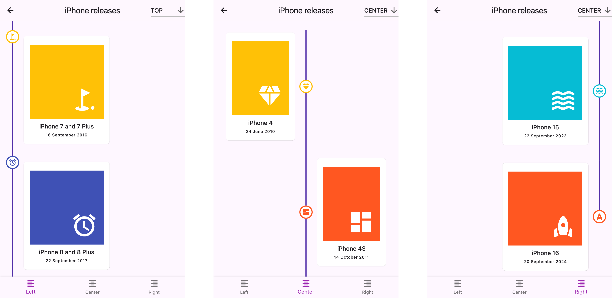
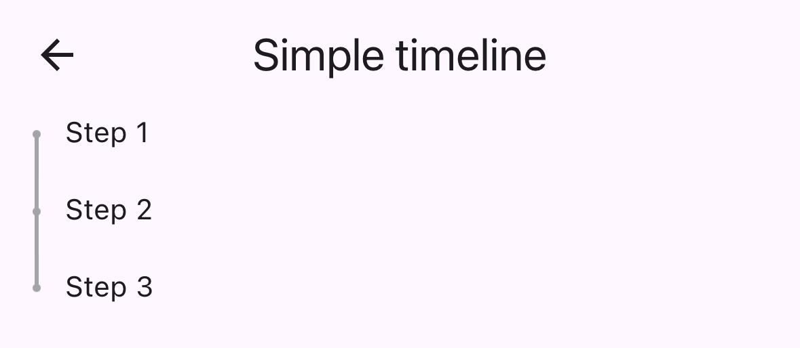
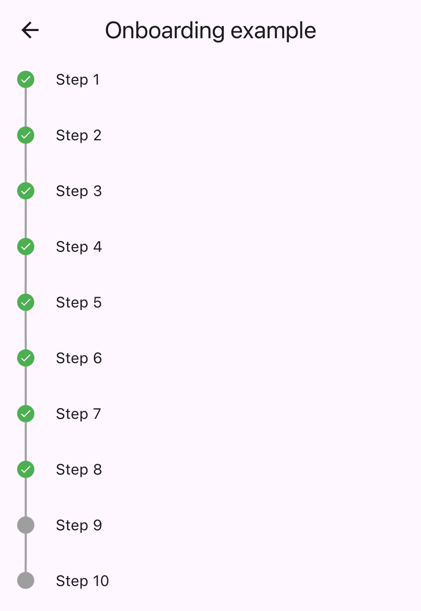

# Flutter Timeline Widget
[](https://pub.dartlang.org/packages/timeline_list)

A highly customizable Flutter widget for displaying vertical timelines with custom markers, icons, and flexible positioning options.



> [!WARNING]
> 🦚 The documentation was created using LLMs. If you notice any errors or typos, please submit a Pull Request or create an issue.

## Features

- 🎯 Three timeline positions: `start` (left), `center`, or `end` (right)
- 🎨 Fully customizable markers with any widget as content or icon
- 📍 Flexible icon alignment: `top`, `center`, or `bottom` of markers
- 🎯 Individual marker positioning for centered timelines
- 🔄 Support for reversed timeline order
- 📱 Custom scroll physics and controller support

## Installation

Add this to your package's `pubspec.yaml` file:

```yaml
dependencies:
  timeline_list: ^0.1.0
```

## Usage

### Simple Timeline



```dart
import 'package:timeline_list/timeline_list.dart';

Timeline(
  children: [
    Marker(child: Text("Step 1")),
    Marker(child: Text("Step 2")),
    Marker(child: Text("Step 3"))
  ],
)
```

### Onboarding Example

Here's a more advanced example showing an onboarding timeline with custom icons:



```dart
var checkIcon = Container(
    width: 16,
    height: 16,
    decoration: BoxDecoration(shape: BoxShape.circle, color: Colors.green),
    child: Icon(Icons.check, color: Colors.white, size: 12));
var emptyIcon = Container(
    width: 16,
    height: 16,
    decoration: BoxDecoration(shape: BoxShape.circle, color: Colors.grey));
return Scaffold(
    appBar: AppBar(title: const Text("Onboarding example")),
    body: Column(children: [
      Timeline.builder(
        context: context,
        markerCount: 10,
        properties: TimelineProperties(
            iconAlignment: MarkerIconAlignment.center,
            iconSize: 16,
            timelinePosition: TimelinePosition.start),
        markerBuilder: (context, index) => Marker(
          child: Padding(
            padding: const EdgeInsets.all(8.0),
            child: Text("Step ${index + 1}"),
          ),
          icon: index >= 8 ? emptyIcon : checkIcon,
          position: MarkerPosition.left,
        ),
      ),
    ]));
```

## Customization

### Timeline Properties

- `timelinePosition`: Controls the overall timeline position (`start`, `center`, `end`)
- `iconAlignment`: Sets icon alignment relative to marker content
- `iconSize`: Defines the size of marker icons
- `lineWidth`: Sets the width of connecting lines
- `lineColor`: Customizes the color of connecting lines
- `itemGap`: Controls spacing between markers
- `iconGap`: Sets gap between icon and marker content

### Marker Properties

- `child`: The main content widget of the marker
- `icon`: Optional custom icon widget
- `position`: Marker position for centered timelines (`left`, `right`)
- `onTap`: Optional callback for marker tap events
- `maxWidth`: Maximum width constraint for marker content

## Examples

Check out the [`example/`](https://github.com/furkantektas/timeline_list/tree/master/example) folder for complete sample applications, including:
- Fully featured timeline with custom icons and widgets
- Simple onboarding flow

## Contributing

This repo is looking for maintainers. Contributions are welcome! Please feel free to submit a Pull Request.

[Thank you for all the contributors!](https://github.com/furkantektas/timeline_list/graphs/contributors)

- [@samramez](https://github.com/samramez)
- [@stijn1989](https://github.com/stijn1989)
- [@JJCLane](https://github.com/JJCLane)
- [@mjhansen3](https://github.com/mjhansen3)

---

Sponsored by:
<div style="text-align: center; background-color: #fff; padding: 20px">
<a href="https://ehlibyte.com" target="_blank">
    
</a>
</div>